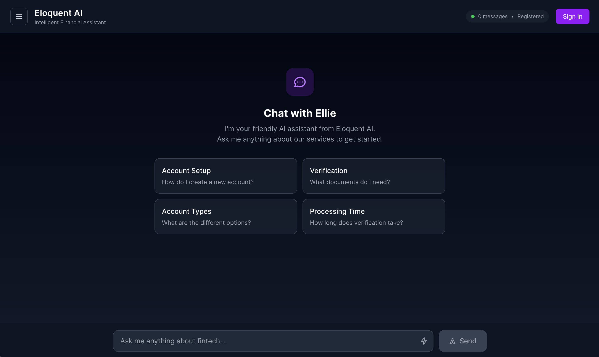

# Ellie, by Eloquent AI

Ellie is an AI-powered chatbot from Eloquent AI. It's designed to provide intelligent assistance for a fintech company. It uses Retrieval-Augmented Generation (RAG) to deliver accurate, context-aware responses by leveraging a Pinecone vector database. The application is built with a Python FastAPI backend and a React + TypeScript frontend, and features a modern, persistent chat environment for both anonymous and authenticated users.



## Key Features

-   **RAG-Powered Chatbot**: Retrieves relevant context from a fintech FAQ knowledge base before generating responses. This helps with accuracy and reduces hallucinations.
-   **Modern UI**: A responsive and intuitive chat interface built with Tailwind CSS.
-   **User Authentication**: Supports both anonymous and registered users with a complete authentication system (register, login, logout) using JWT.
-   **Persistent Chat History**: Conversations are saved to a database, allowing users to view and continue their chat history across sessions.
-   **Advanced Frontend**:
    -   Chat history sidebar with session management.
    -   Welcome screen with starter prompts.
    -   Smooth loading states and transitions.
    -   Ability to type responses while the AI is generating its reply.
    -   Intelligent logout flow that saves the current chat to the user's account.
-   **Automated Setup**: A simple `start.sh` script handles environment setup, data loading, and server startup.
-   **AWS Ready**: Designed for a straightforward deployment to AWS.

## Tech Stack

| Area      | Technology                                    |
| :-------- | :-------------------------------------------- |
| **Backend** | Python, FastAPI, SQLAlchemy, Uvicorn        |
| **Frontend**| React, TypeScript, Vite, Tailwind CSS    |
| **AI/ML**   | Google Gemini, Sentence Transformers        |
| **Database**| Pinecone (Vector DB), SQLite (Session DB)   |
| **Auth**    | JWT, passlib[bcrypt]                          |

---

## Getting Started

### Prerequisites

-   Python 3.10+
-   Node.js 18+
-   Docker and Docker Compose

### 1. Clone the Repo

```bash
git clone https://github.com/TiborThompson/Ellie_by_Eloquent.git
cd Ellie_by_Eloquent
```

### 2. First-Time Setup

For the initial setup, run the `setup.sh` script. This will check for prerequisites, help you create your `.env` file, and install all the necessary Python and Node.js dependencies.

```bash
./setup.sh
```
This script will guide you through creating your `.env` file and will pause to let you add your API keys.

### 3. Running the Application

Once the initial setup is complete, you can start the entire application using Docker Compose with the `start.sh` script.

```bash
./start.sh
```

-   The **Backend** will be available at `http://localhost:8000`
-   The **Frontend** will be available at `http://localhost:5173`

Open `http://localhost:5173` in your browser to start chatting.

### 4. Stopping the Application

To stop all running Docker containers, use the `stop.sh` script.

```bash
./stop.sh
```

### 5. Running Tests

A comprehensive test suite is included, which runs backend unit tests and end-to-end API tests against the live application. Make sure the application is running (`./start.sh`) before you run the tests.

```bash
./test.sh
```

---

## Project Structure

```
Ellie_by_Eloquent/
├── .dockerignore
├── .env.example
├── .gitignore
├── backend/
│   ├── app/
│   │   ├── api/
│   │   ├── core/
│   │   ├── models/
│   │   ├── services/
│   │   └── main.py
│   ├── tests/
│   └── requirements.txt
├── data/
│   └── fintech_faq.json
├── frontend/
│   ├── public/
│   ├── src/
│   │   ├── components/
│   │   └── App.tsx
│   ├── Dockerfile
│   └── package.json
├── Deployment.md
├── README.md
├── docker-compose.yml
├── setup.sh
├── start.sh
├── stop.sh
└── test.sh
```

## AWS Deployment Strategy

For details on deploying this application to AWS, see the [AWS Deployment Strategy](Deployment.md) document. 